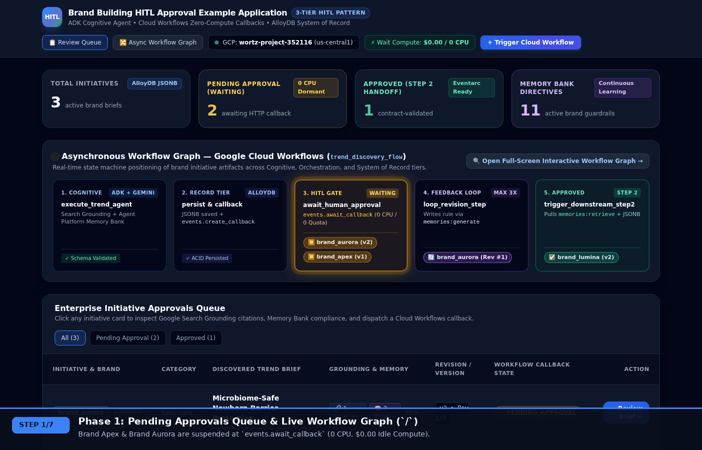
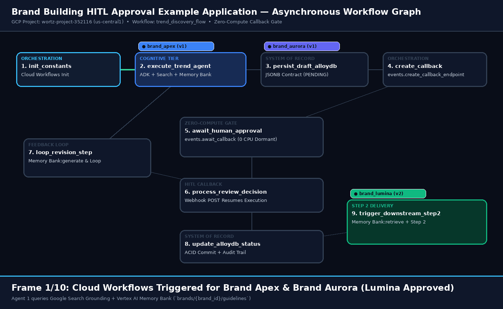
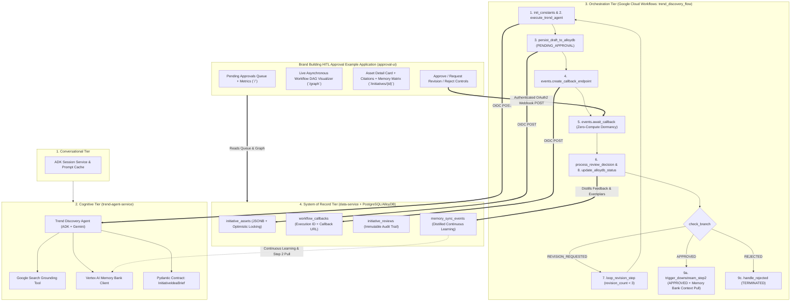

# Brand Building HITL Approval Example Application (`geap-hitl-pattern`)

**Reference Implementation of the 3-Tier Enterprise Agentic Architecture & Zero-Compute Human-in-the-Loop (HITL) Pattern on Google Cloud**

[](https://console.cloud.google.com/workflows?project=wortz-project-352116)
[](workflows/trend_discovery_flow.yaml)
[-10B981)](evals/results/latest_run.json)
[](tests/)

---

## 1. Visual Walkthrough: Human-in-the-Loop & Asynchronous Workflow Graph

### 1.1 Live Human-in-the-Loop (HITL) Approval Process (`docs/assets/hitl_approval_workflow.gif`)

Recorded live against our **Brand Building HITL Approval Example Application** (`https://approval-ui-679926387543.us-central1.run.app`), showing:
1. **Pending Approvals Queue (`/`)**: Viewing active brand initiatives suspended on zero-compute Cloud Workflows callbacks (`$0.00 Idle Compute / 0 CPU`).
2. **Asynchronous Workflow Graph Monitor (`/graph`)**: Inspecting real-time token placement across the 3-Tier Architecture.
3. **Asset Detail Review Card (`/initiatives/{id}`)**: Inspecting verified **Google Search Grounding Citations** (`energy.gov`, `americancleaninginstitute.org`) and the **Vertex AI Memory Bank Compliance Matrix**.
4. **Revision Loop & Continuous Learning (`REVISION_REQUESTED`)**: Submitting Brand Director feedback, waking the suspended Cloud Workflow via authenticated HTTP callback, distilling the critique into a reusable **Vertex AI Memory Bank** directive (`mem_sync_*`), and re-executing Agent 1 (`Version 2 • Revision 1/3`).
5. **Final Approval & Step 2 Memory Bank Context Pull (`APPROVED`)**: Dispatching the final approval callback to transition AlloyDB status to `APPROVED`, distilling the approved exemplar into Vertex AI Memory Bank, and pulling the clean **Memory Bank + AlloyDB JSONB Contract context bundle** for downstream Step 2 asset generation.



---

### 1.2 Asynchronous Multi-Artifact Workflow Graph Progression (`docs/assets/async_workflow_graph.gif`)

Visual representation of the **9-Node Google Cloud Workflows State Machine DAG (`trend_discovery_flow`)** as multiple generic brand initiatives (`brand_apex`, `brand_aurora`, `brand_lumina`) progress asynchronously across states (`PENDING_APPROVAL` → `REVISION_REQUESTED` → `Memory Distillation` → `APPROVED`):



---

## 2. Live Deployed Google Cloud Services (`wortz-project-352116` • `us-central1`)

All components of the **Brand Building HITL Approval Example Application** are deployed and verified on Google Cloud Platform project **`wortz-project-352116`**:

| Tier / Component | GCP Service | Deployed Resource / Endpoint | Status |
| :--- | :--- | :--- | :--- |
| **Component A: Cognitive Tier** | Cloud Run + Vertex AI Gemini (`google-genai`) + Search Grounding + Memory Bank | [`https://trend-agent-service-679926387543.us-central1.run.app`](https://trend-agent-service-679926387543.us-central1.run.app/health) | ✅ `ACTIVE` |
| **Component B: System of Record API** | Cloud Run + Embedded PostgreSQL 16 (`asyncpg`) + Cloud Firestore Durability | [`https://data-service-679926387543.us-central1.run.app`](https://data-service-679926387543.us-central1.run.app/health) | ✅ `ACTIVE` |
| **Component C: Durable Orchestrator** | Google Cloud Workflows (`events.create_callback_endpoint` & `events.await_callback`) | `projects/wortz-project-352116/locations/us-central1/workflows/trend_discovery_flow` (Rev `000001-0ba`) | ✅ `ACTIVE` |
| **Component D: HITL Approval UI & Graph** | Cloud Run FastAPI + Jinja2 + Interactive Workflow DAG Visualizer | [`https://approval-ui-679926387543.us-central1.run.app`](https://approval-ui-679926387543.us-central1.run.app) | ✅ `ACTIVE` |
| **IAM Workload Identity** | Google Cloud IAM Service Account | `workflow-runner-sa@wortz-project-352116.iam.gserviceaccount.com` | ✅ `ACTIVE` |

### Verified Live Cloud Workflows Execution Lifecycle (`33be042f-107b-4216-aa01-4b58e4af617a`)

1. **Zero-Compute Callback Suspension (`state: ACTIVE`, `step: await_human_approval`)**:
   ```yaml
   name: projects/679926387543/locations/us-central1/workflows/trend_discovery_flow/executions/33be042f-107b-4216-aa01-4b58e4af617a
   state: ACTIVE
   status:
     currentSteps:
     - routine: main
       step: await_human_approval
   callback_url: https://workflowexecutions.googleapis.com/v1/projects/679926387543/locations/us-central1/workflows/trend_discovery_flow/executions/33be042f-107b-4216-aa01-4b58e4af617a/callbacks/55856c97-81e7-4e0a-924c-be8a1b86c002_dcad02e5-5a22-4d7d-885a-ee4b6464165a
   ```
2. **Revision Loop Resumption (`REVISION_REQUESTED` → `revision_count: 1`) & Final Approval (`state: SUCCEEDED`)**:
   ```yaml
   name: projects/679926387543/locations/us-central1/workflows/trend_discovery_flow/executions/33be042f-107b-4216-aa01-4b58e4af617a
   result: '{"initiative_id":"a1000000-0000-4000-8000-000000000001","outcome":"APPROVED","revision_count":1,"status":"SUCCESS"}'
   state: SUCCEEDED
   status:
     currentSteps:
     - routine: main
       step: return_approved
   ```

---

## 3. Architecture & Data Lifecycle



---

## 4. Repository Structure

```text
geap-hitl-pattern/
├── README.md                               # Architecture, live GCP links, embedded GIFs, and runbook
├── LICENSE                                 # Apache 2.0 license
├── Makefile                                # setup, test, eval, deploy-gcp, trigger-workflow, record-gifs
├── Dockerfile                              # Multi-service Cloud Run container with PostgreSQL 16 + FastAPI
├── docker-compose.yml                      # Local stack (AlloyDB Omni / PostgreSQL 16 + all 3 services)
├── .env.example                            # Documented environment template (zero secrets)
├── .gitignore                              # Strict secret & .env exclusion policy
├── docs/assets/
│   ├── hitl_approval_workflow.gif          # Recorded Playwright walkthrough of the HITL web interface
│   └── async_workflow_graph.gif            # Animated 9-node Cloud Workflows DAG & artifact state transitions
├── terraform/                              # Infrastructure as Code (AlloyDB Primary + Read Pool, Workflows, Cloud Run, IAM)
├── database/
│   ├── migrations/
│   │   ├── 001_initial_schema.sql          # Relational DDL (`initiative_assets`, `workflow_callbacks`, `initiative_reviews`, `memory_sync_events`)
│   │   └── 002_seed_data.sql               # Seeded generic brand fixtures (`brand_apex`, `brand_aurora`, `brand_lumina`)
│   └── db_client.py                        # Asyncpg pool + Cloud Firestore durability + optimistic concurrency locking
├── workflows/
│   ├── trend_discovery_flow.yaml           # Production Google Cloud Workflows state machine definition
│   └── workflow_config.json                # Workflow substitution config
├── services/
│   ├── trend_agent/                        # Component A: ADK Agent, Search Grounding, Memory Bank, Pydantic Schemas
│   ├── data_service/                       # Component B: CRUD API, Optimistic Locking, Authenticated Callback Proxy
│   └── approval_ui/                        # Component D: Brand Building HITL Approval Example Application UI & Workflow Graph
├── evals/                                  # Antigravity Evaluation Suite (4 deterministic & semantic rubrics)
├── antigravity/                            # CLI module entrypoint (`python -m antigravity.evaluate`)
└── tests/                                  # Unit & End-to-End Integration test suites (`pytest`)
```

---

## 5. Quickstart & Operation Runbook

### 5.1 Environment Setup & Secret Hygiene

```bash
cp .env.example .env
# Edit .env locally if needed (.env is strictly gitignored so no secrets are ever committed)
make setup
```

### 5.2 Run Unit & Integration Tests (`pytest`)

```bash
make test
# 9 passed in 0.91s (tests/unit/test_agent_schemas.py, tests/unit/test_memory_integration.py, tests/integration/test_alloydb_persistence.py, tests/integration/test_e2e_workflow.py)
```

### 5.3 Run Antigravity Evaluation Suite (`100% Pass Rate`)

```bash
PYTHONPATH=. uv run python -m antigravity.evaluate \
  --config evals/eval_config.yaml \
  --dataset evals/test_dataset.jsonl \
  --output evals/results/latest_run.json
```

### 5.4 Trigger a Live Cloud Workflow Execution on GCP (`wortz-project-352116`)

```bash
gcloud workflows execute trend_discovery_flow \
  --location=us-central1 \
  --project=wortz-project-352116 \
  --data='{"brand_id": "brand_apex", "category": "fabric_care", "search_query": "cold water eco wash consumer trends 2026"}'
```
Then open [`https://approval-ui-679926387543.us-central1.run.app`](https://approval-ui-679926387543.us-central1.run.app) to inspect the grounded brief, view the live Workflow Graph (`https://approval-ui-679926387543.us-central1.run.app/graph`), request revisions, or approve the initiative!
